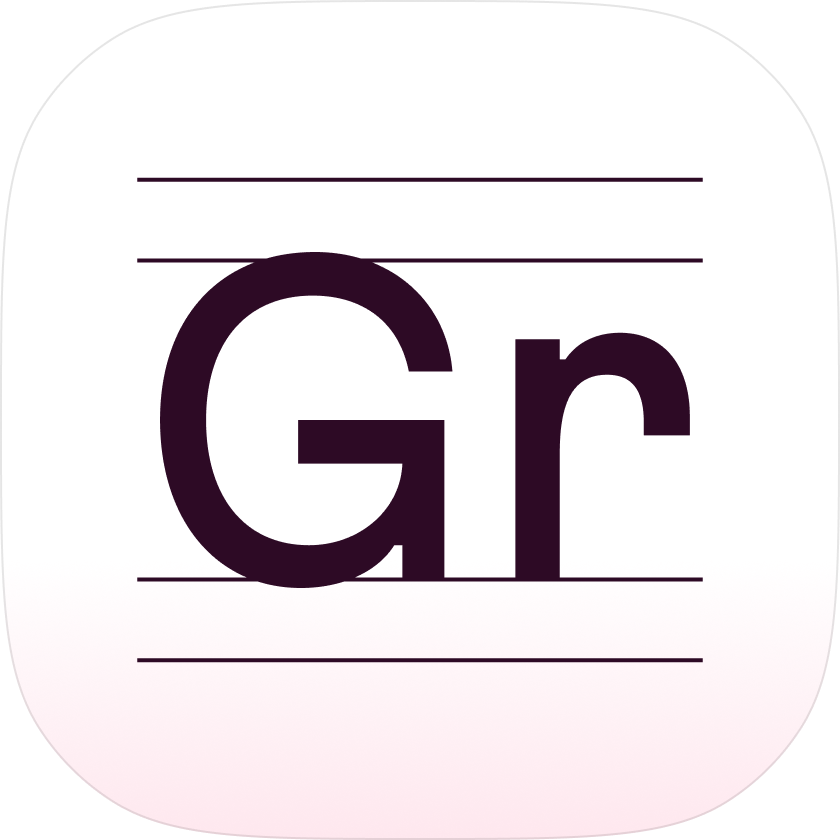
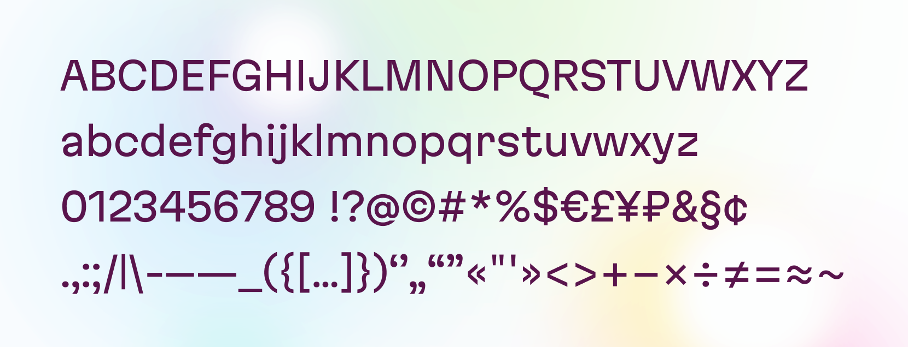
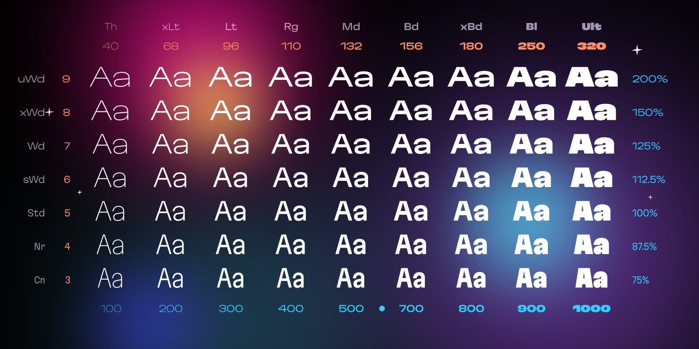
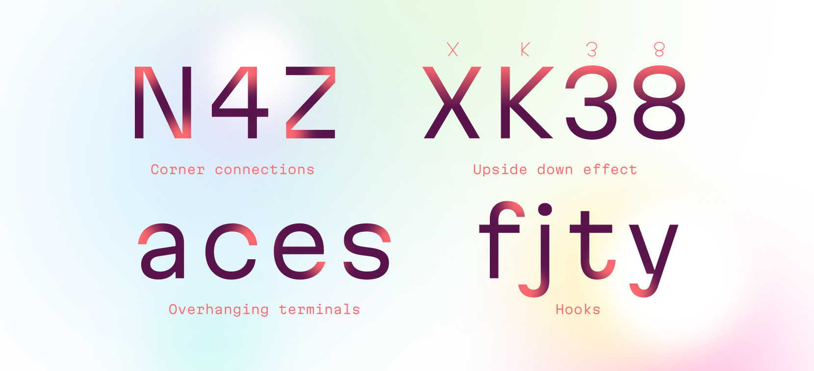
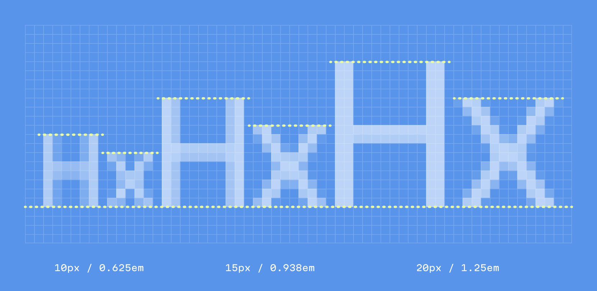
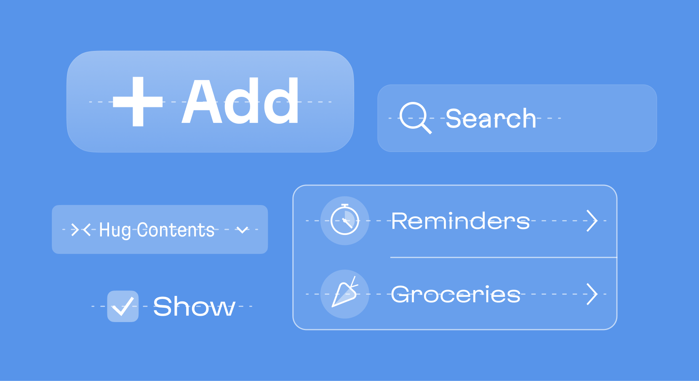
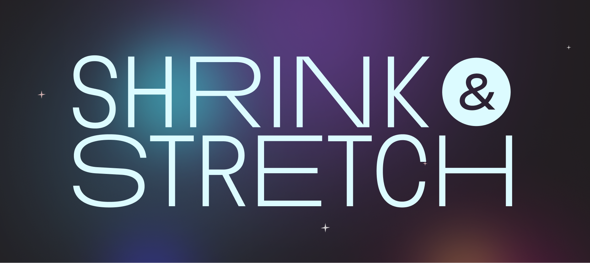
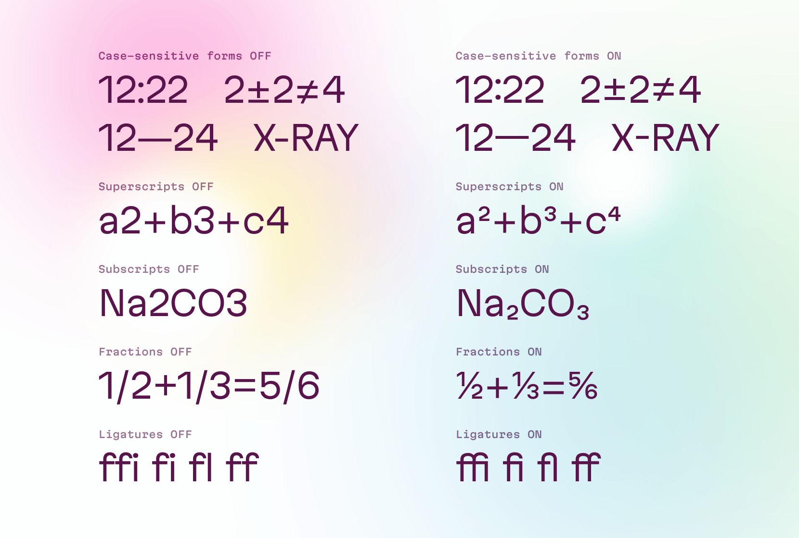
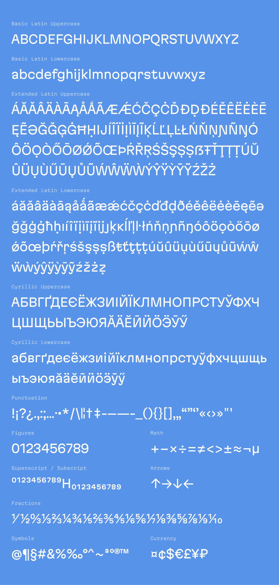

# Martian Grotesk

Martian Grotesk is a sans-serif variable typeface family with a distinctive personality. It includes 63 static styles and is variable along two axes: weight (from Thin to Ultra Black) and width (from Condensed to Ultra Wide). Its subtly brutalist character makes it stand out visually, while styles from regular to bold are finely tuned for use in body text.

It’s especially optimized for on-screen use. Vertical metrics ensure that text labels appear vertically centered within UI elements. Character heights are aligned to the pixel grid for extra clarity and sharpness, and both PostScript and TrueType hinting are applied automatically.



Also, check out Grotesk’s monospaced sibling—[Martian Mono](https://github.com/evilmartians/mono).

---

  Made
by
<b><a href="https://evilmartians.com/devtools?utm_source=martian-grotesk&utm_campaign=devtools-button&utm_medium=github">Evil
Martians</a></b>, product consulting for <b>developer tools</b>.

---

## Styles and weights

Martian Grotesk includes 63 static styles: [Thin—Ultra Black] × [Condensed—Ultra Wide].



For better legibility in design editor font pickers—where font lists are usually shown in narrow dropdowns—style names use shortened forms.

### Weight
| Code | Name         |
|------|--------------|
| Th   | Thin         |
| xLt  | Extra Light  |
| Lt   | Light        |
| Rg   | Regular      |
| Md   | Medium       |
| Bd   | Bold         |
| xBd  | Extra Bold   |
| Bl   | Black        |
| Ult  | Ultra Black  |

### Width
| Code | Name         |
|------|--------------|
| Cn   | Condensed    |
| Nr   | Narrow       |
| Std  | Standard     |
| sWd  | Semi Wide    |
| Wd   | Wide         |
| xWd  | Extra Wide   |
| uWd  | Ultra Wide   |

## Design

### Personality

Martian Grotesk is designed for body text, but its distinct details take it a few steps beyond a neutral typeface. Features like overhanging terminals in characters such as `a`, `e`, and `s`, and monospaced-style hooks in `f`, `j`, and `t` give the text a recognizable “flavor.” This makes Martian Grotesk a strong foundation for any brand looking to stand out and be instantly recognizable.



### Pixel grid optimization

The proportions of uppercase and lowercase letterforms are optimized relative to the EM box to align with the pixel grid at sizes like 10, 15, 20 pixels, and so on.



### Vertical metrics for UI design

The vertical metrics across the entire family are carefully balanced to ensure text appears vertically centered within UI elements and aligns well with icons.



Check out [this X thread](https://x.com/romanshamin_en/status/1562801657691672576) on how vertical metrics can make fonts work better in design systems.

### Constant stem widths

Stem widths are specifically designed to stay consistent within each weight. For example, all Regular styles share the same stem width. This allows for shrinking or stretching letters within words without breaking visual harmony.



### OpenType features



## Web use

Use the following code to embed:

```css
@font-face {
  font-family: Martian Grotesk;
  font-display: swap;
  src: url('front/fonts/...') format('woff2');
  font-weight: 100 1000; /* Th: 100, xLt: 200, Lt: 300, Rg: 400, Md: 500, (no 600), Bd: 700, xBd: 800, Bl: 900, Ult: 1000 */
  font-stretch: 75% 200%; /* Cn: 75%,  Nr: 87.5%,  Std: 100%,  sWd: 112.5%,  Wd: 125%,  xWd: 150%,  uWd: 200% */
}

@font-face {
  font-family: Martian Mono;
  font-display: swap;
  src: url('front/fonts/...') format('woff2');
  font-weight: 100 800; /* Th: 100, xLt: 200, Lt: 300, Rg: 400, Md: 500, (no 600), Bd: 700, xBd: 800 */
  font-stretch: 75% 112.5%; /* Cn: 75%,  Nr: 87.5%,  Std: 100%,  sWd: 112.5% */
}
```

## Language support

The typeface supports 308 languages: 297 based on the Latin script and 11 using the Cyrillic script.


